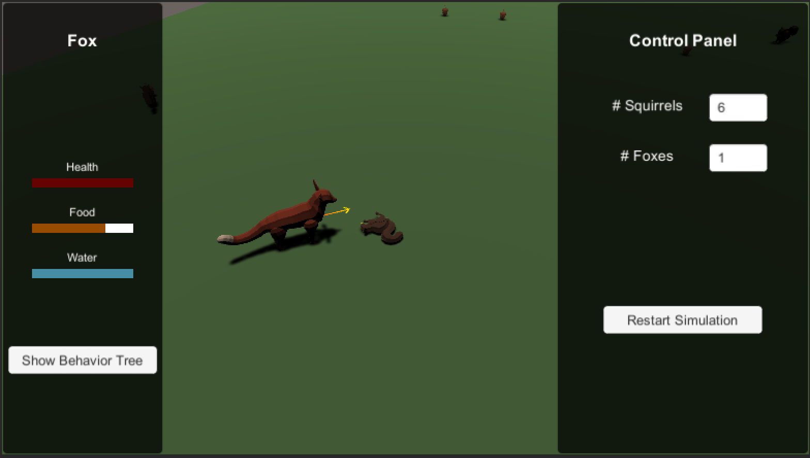
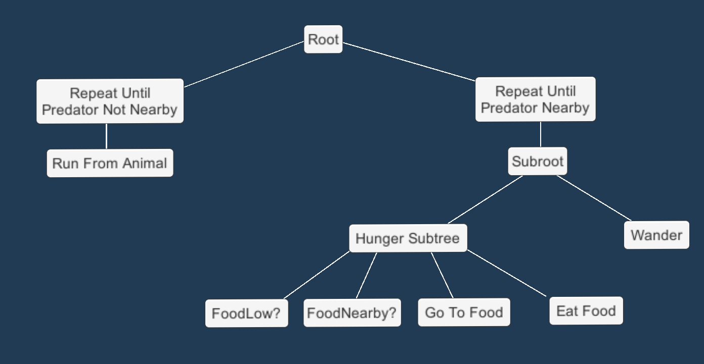
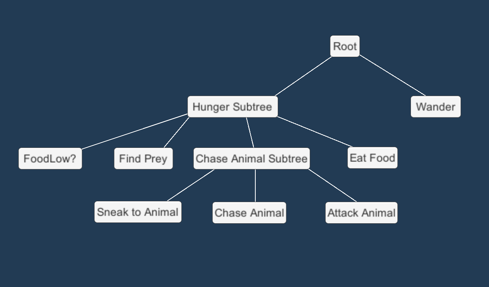
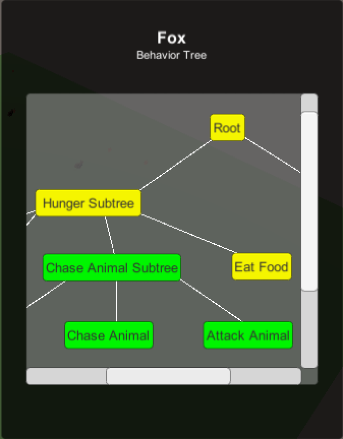

# Animal Simulation with Behavior Trees

**University of Pennsylvania, Senior Design Project (in-progress)** by Janine Liu

[LinkedIn](https://www.linkedin.com/in/liujanine/) | [Website](https://www.janineliu.com/)

---------------

This project explores the concept of behavior trees and uses them to simulate simple animal behavior Unity. It is inspired by the gameplay and aesthetic of _[SimAnimals](https://en.wikipedia.org/wiki/SimAnimals)_, which is an animalistic version of _The Sims_ that takes place in a woodland setting. In summary, this repository:
- provides generic `Node` and `Tree` definitions as a basic framework for behavior trees (see [Assets/Scripts/BehaviorTree](https://github.com/j9liu/AnimalSim/tree/main/Assets/Scripts/BehaviorTree)).
- adapts these generic classes for animal behavior by:
  -  defining `Condition`s and `Action`s for use and reuse by multiple animals, e.g. `Wander` and `FoodLow`.
  -  structuring behavior trees for each animal species based on these custom nodes.
- uses the resulting behavior trees in the Unity engine, where they are evaluated at every `Update`.

Behavior trees allow for intuitive construction and organization of agent behavior, as well as reusability across agent types. In my variation of behavior trees, I did not implement a "blackboard" or database that tracks all of the variables in the game's state. Instead, I felt the behavior trees should reflect the intimate knowledge of their animal, and any external knowledge that the animal needs should be accessible through the animal's built-in functionality.

|  |  |
| ---| --- |
| Structure of the squirrel behavior tree. | Structure of the fox behavior tree. |

|  |
| --- |
| Debug view of a behavior tree being evaluated at runtime. |

This project is not polished and I would like to make numerous improvements to it. I will maintain a list of these tasks [here](Docs/TODO.md).
